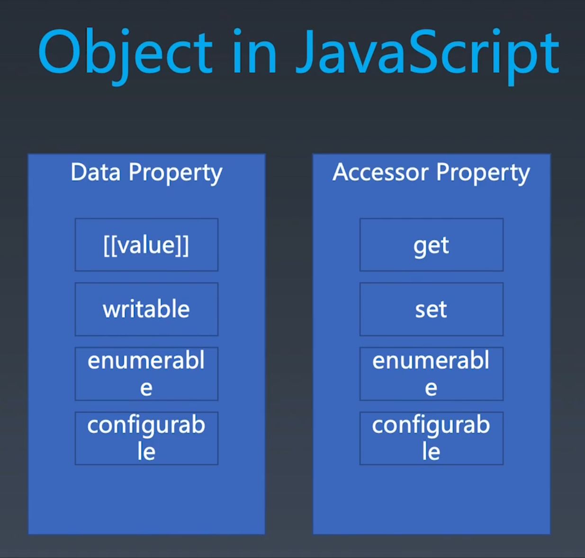

# js

## 7 种基本类型

Number String Boolean Object Null Undefined Symbol

## 理解 Object

地址不相等，内容可以相等

唯一标识，状态和行为三合一。

state identifier behavior

scheme + prototype + 面向对象

## object property

property prototype

| key           |         value |
| :------------ | ------------: |
| Symbol String | Data Accessor |

guid??

## object prototype

## Object Api

{} [] . Object.defineProperty

Object.create / Object.setPrototypeOf / Object.getPrototypeOf

new / class / extends

new / function / prototype

## Function Object

[[call]]

## Special Object

## Host Object

call construct
